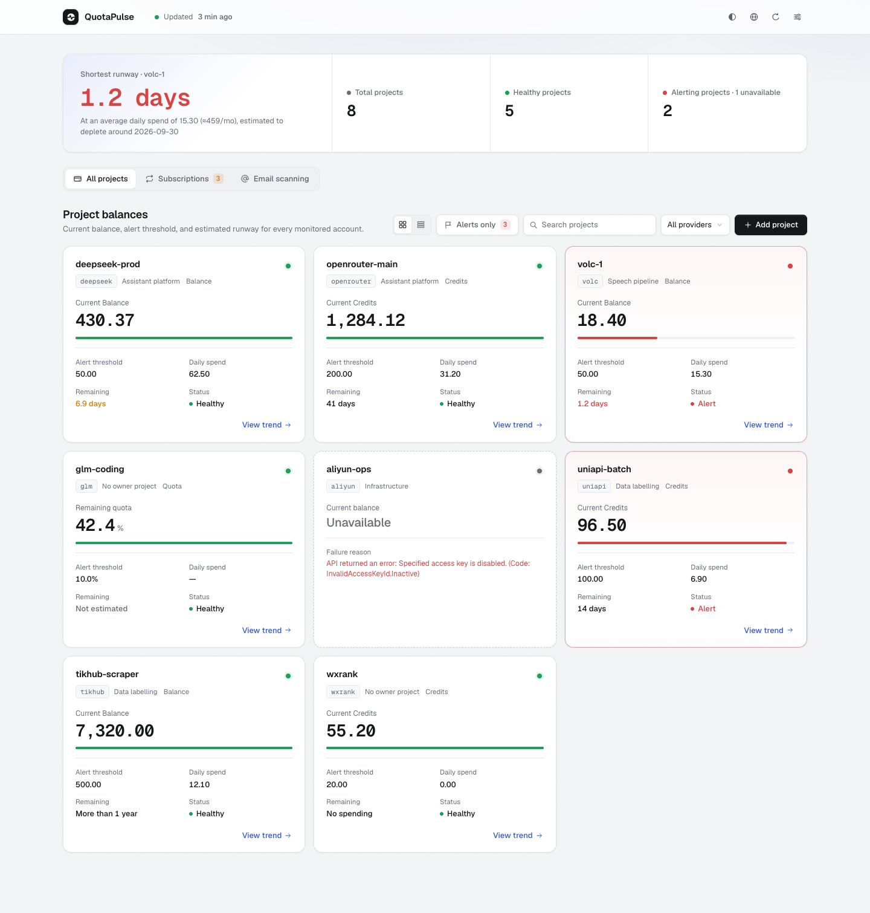
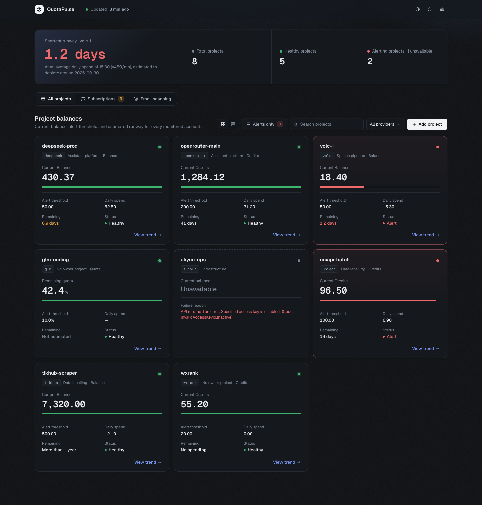
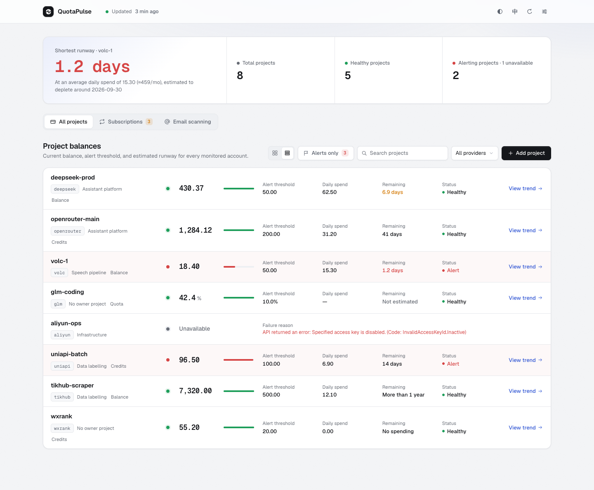
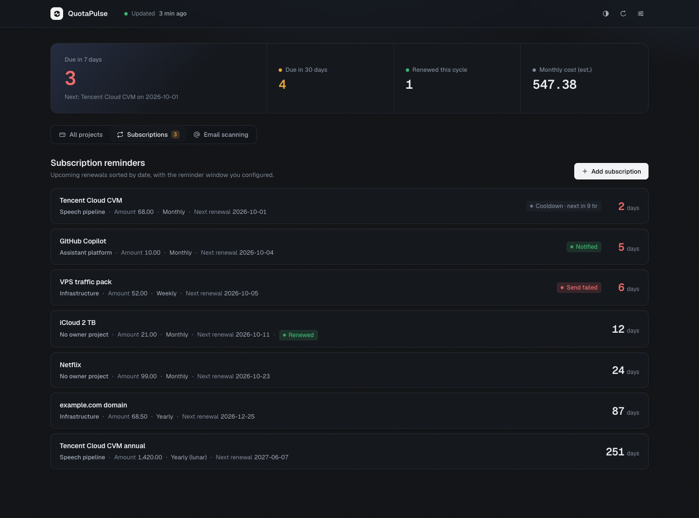
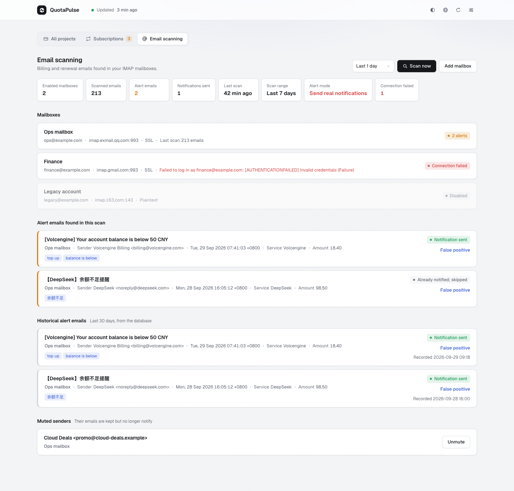
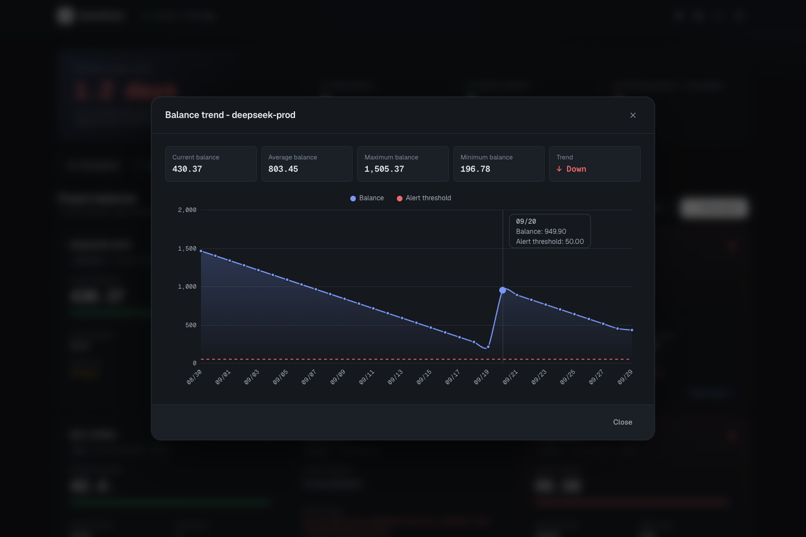
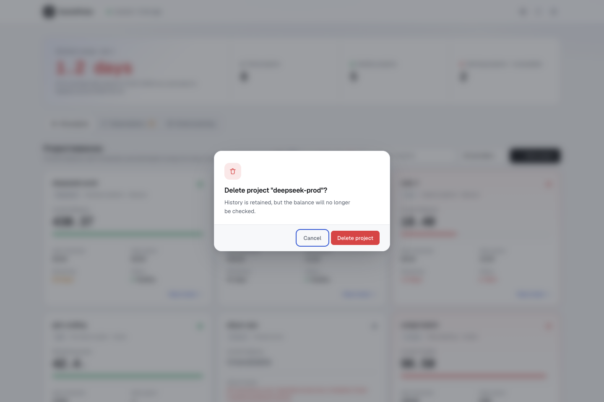
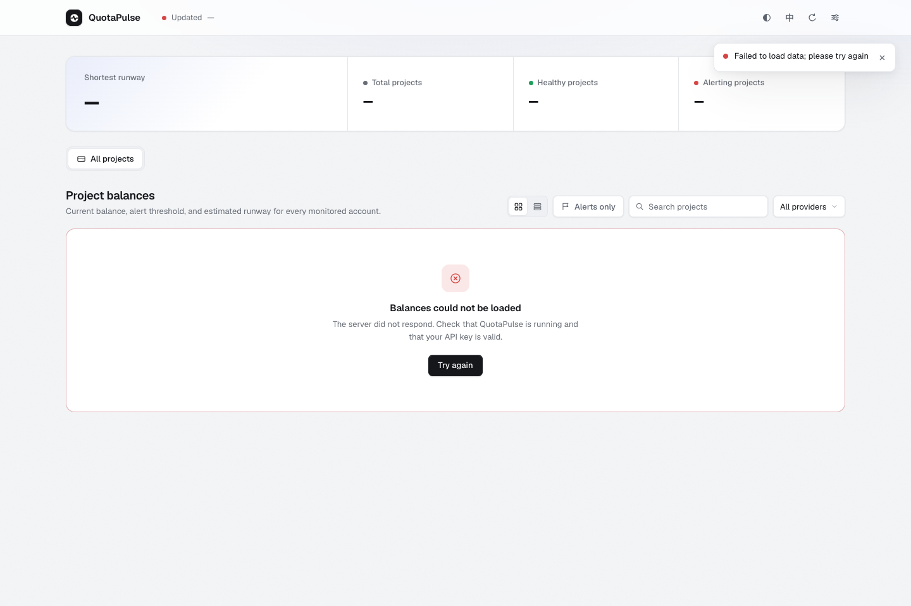
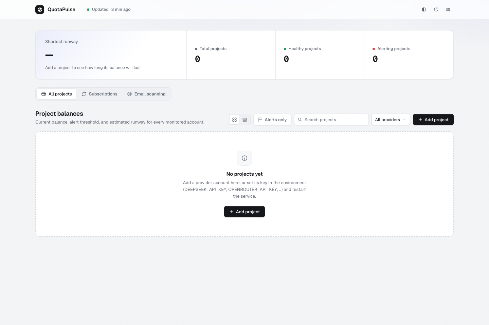
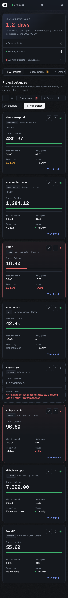

# QuotaPulse in pictures

QuotaPulse is a single self-hosted binary that watches the paid API accounts your work
depends on. It checks balances across providers, estimates how long each balance will
last, reminds you before subscriptions renew, and reads billing emails straight from
your mailbox — then tells you before things run dry, not after.

This page walks through the project using screenshots. Everything shown runs on demo
data; the interface ships in light and dark themes and follows your system preference
until you toggle it. For installation and configuration, see the
[README](../README.md); for the icon system, see [icons.md](icons.md).

## One dashboard for every account

The landing view answers the only question that matters at a glance: how long until
something runs out. The overview band leads with the shortest runway across all
accounts — here `volc-1` has 1.2 days left — followed by the total, healthy, and
alerting project counters. The time of the last successful check sits in the top
navigation beside the brand, on phones too, and the dot next to it turns amber or red
when the data ages out, a refresh fails, or every account fails its check. It stays red
until a load succeeds.

A live amber badge appears on Subscriptions in the view switcher when renewals enter
their reminder window, and it disappears at zero, so a quiet system stays quiet. In the
projects toolbar, an Alerts only chip narrows the cards down to accounts below their
threshold and carries the same red count — a filter that lives with the list it
filters, not a second kind of page. Each view also reshapes the overview band to answer
its own question — projects show runway and counters, subscriptions show renewal
stats, and on the email view the band steps aside for the scan summary chips.

Each project card shows the current balance in a large monospace figure, the alert
threshold as a colored progress bar, daily spend, and the runway estimate. Accounts
below threshold are tinted red with a pulsing dot; an account whose key stopped working
says so plainly — `aliyun-ops` shows "Unavailable" with the exact API error inline,
instead of pretending the balance is zero — and it counts under Alerts only, because an
account that can't be read isn't being monitored.

## Know before you run dry

Runway is the core idea. QuotaPulse stores balance snapshots, measures how fast each
account actually burns, and projects a depletion date — "at 15.30 per day, this account
is empty around 2026-09-30". Estimates that lack enough history say so honestly instead
of guessing. When an account drops below its threshold, its card turns red at the next
refresh and the alert goes out at the next scheduled alert check — 09:00 and 15:00
unless `ALERT_SCHEDULE` says otherwise, or every refresh with `ENABLE_WEB_ALARM=true`.
A cooldown then holds it to once a day while the balance stays low, with or without the
database. A check that fails outright, such as a revoked key, alerts the same way.

## Two ways to read the same data

The grid view is for scanning; the list view is for comparing. The same numbers stay
aligned in a compact table, and the toggle remembers your choice.

## Never miss a renewal

Subscriptions are sorted by next renewal date. The days-remaining figure turns amber two
weeks out and red once the renewal enters its reminder window. Paid for a renewal? Mark
it: the mark covers that one renewal, so its reminders stop and the card moves on to the
next date, which gets its reminders as usual when its window opens. Weekly, monthly,
Gregorian-yearly, and lunar-yearly cycles are all supported. Switching to this view
reshapes the overview band: the hero figure becomes the number of renewals due within
7 days — with the next one named — flanked by due-in-30-days, renewed-this-cycle, and an
estimated monthly cost that normalizes the different billing cycles.

## Let the mailbox do the bookkeeping

Point QuotaPulse at an IMAP mailbox and it picks out the billing emails that need action
by keyword, in English and Chinese: low or insufficient balance, overdue and unpaid
bills, expiry and renewal notices, suspensions. `EMAIL_EXTRA_ALERT_KEYWORDS` adds words
of your own, such as "invoice" to catch every invoice. Summary chips show what a scan
found, each mailbox reports its own connection status, and matched emails are listed
with the keywords that flagged them and whether a notification went out. A false
positive can be muted per sender, and unmuted again under Muted senders.

## History you can see

With the optional database enabled, every check becomes a data point. "View trend" on a
card opens a 30-day balance chart with the alert threshold as a dashed line and a hover
tooltip. The chart draws with the theme's own colors and fonts, in both modes.

## Safe to operate

Destructive actions get an in-page confirmation with the focus on Cancel — no browser
popups, no accidental deletes. Forms validate inline, right next to the field. When the
backend cannot be reached, the dashboard says so and offers a retry instead of leaving
skeletons on screen.

## Good from the first minute

A fresh install shows a getting-started panel that names the exact environment variable
to set, rather than an empty grid. Filters that match nothing offer a one-click reset.

## Light, dark, and pocket-sized

Dark mode is a first-class theme, applied before the first paint so it never flashes.
On a phone the counters collapse into rows, the view switcher scrolls horizontally, and
card actions stay visible.

## Under the hood

All of this ships as one Go binary with the frontend embedded: no separate static
directory, no external font or icon CDNs — the typefaces (Geist) and the icon sprite
travel inside the binary. Balance history, runway estimates, and spending-spike
detection run from snapshots in an optional database. The same data is exposed as
Prometheus metrics, through a documented HTTP API, and via a read-only MCP endpoint for
AI assistants. See [ARCHITECTURE.md](ARCHITECTURE.md) and [API.md](API.md).
