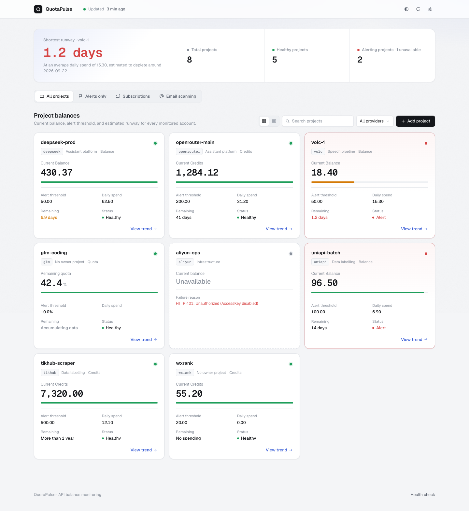
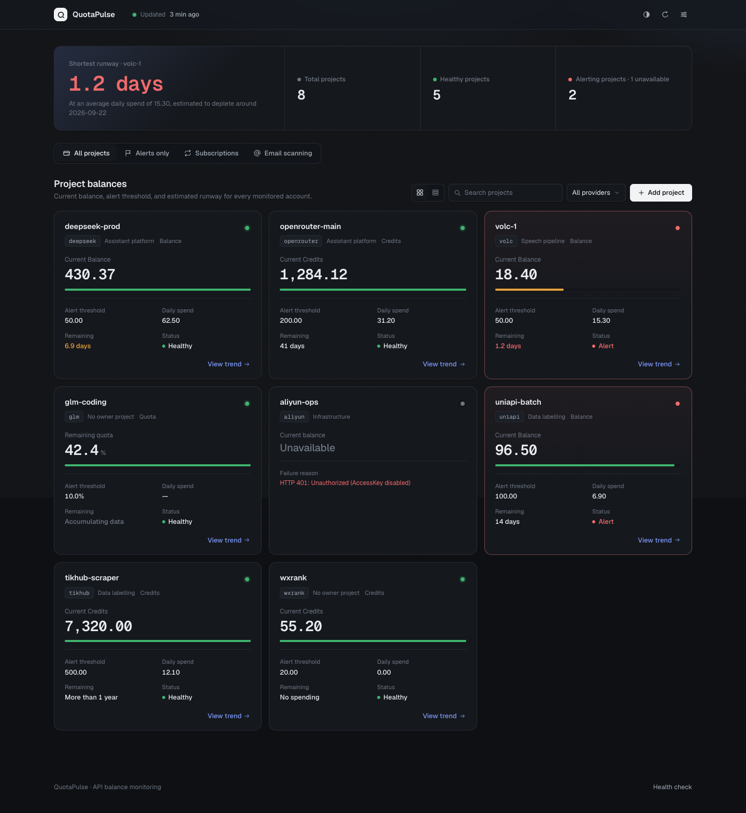
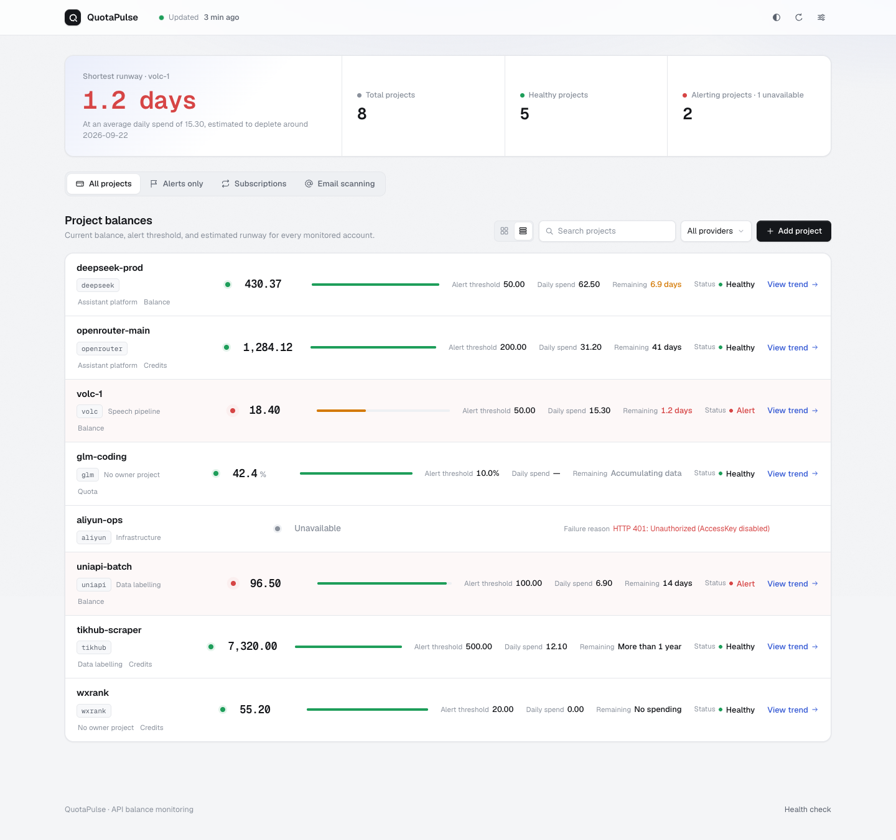
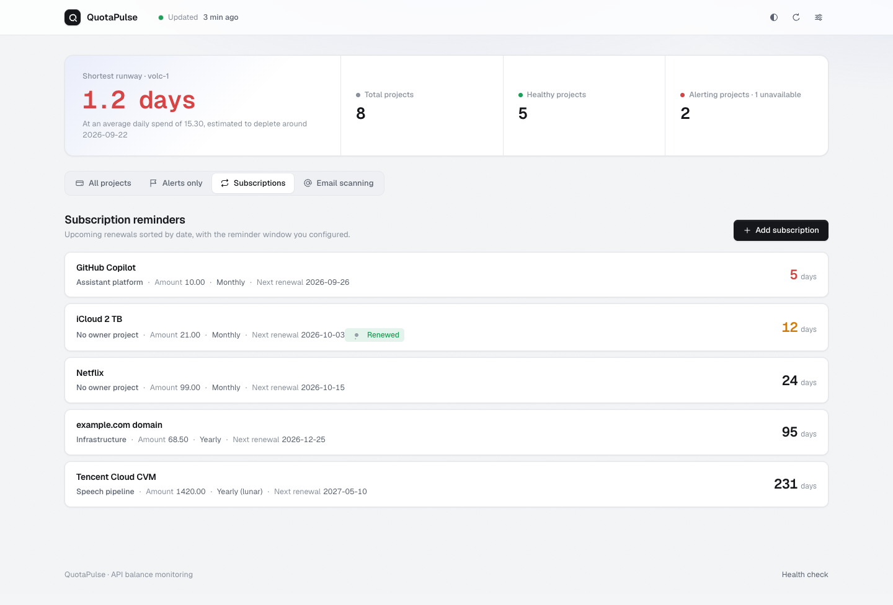
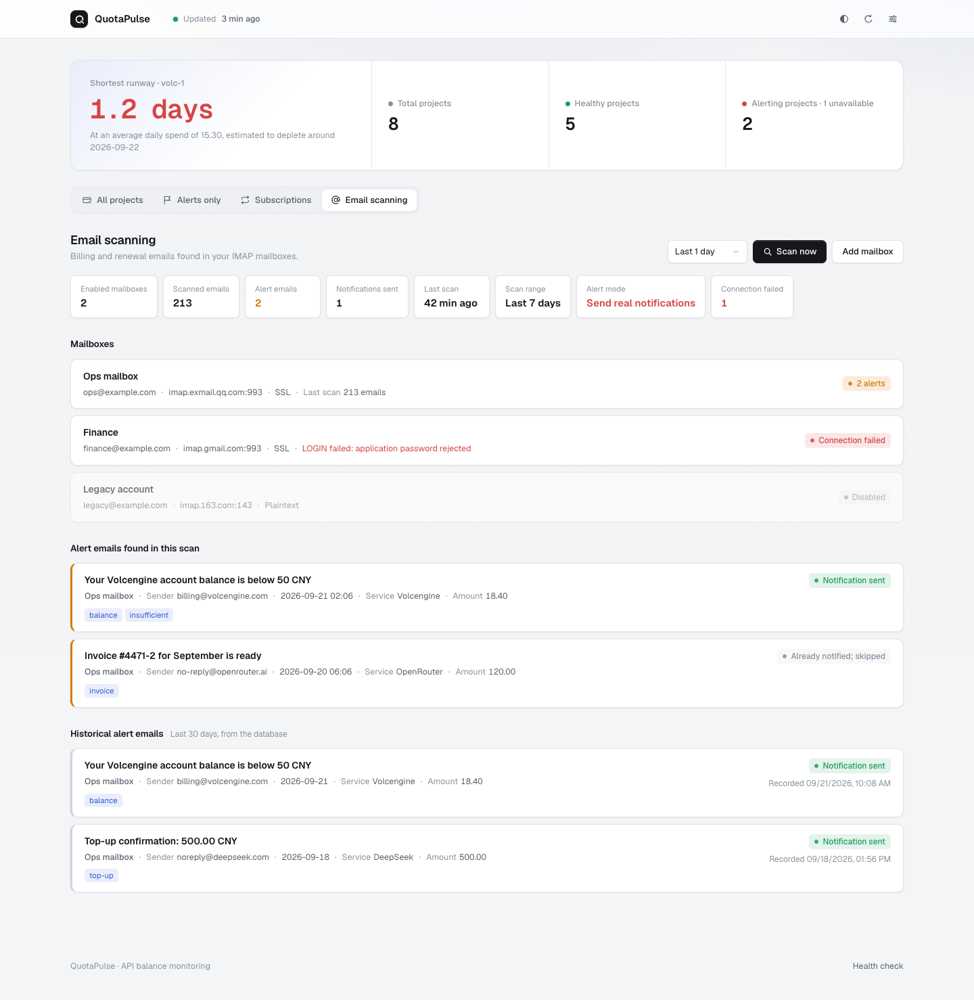
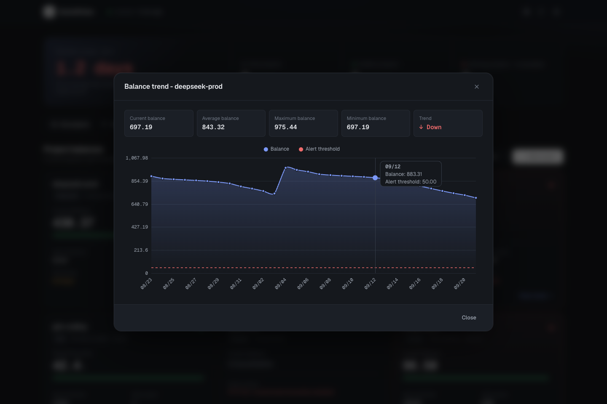
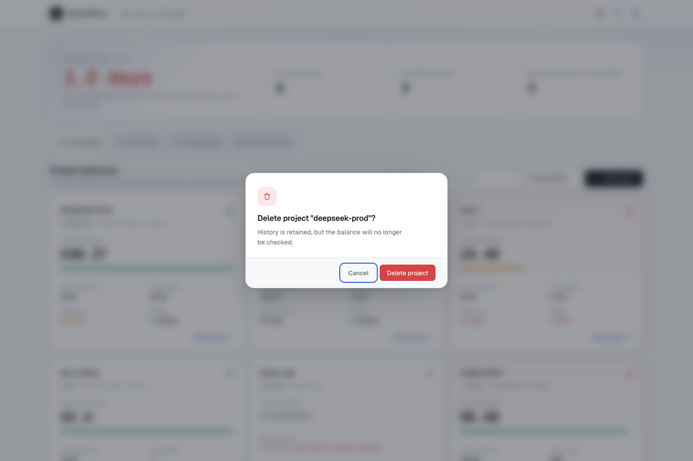
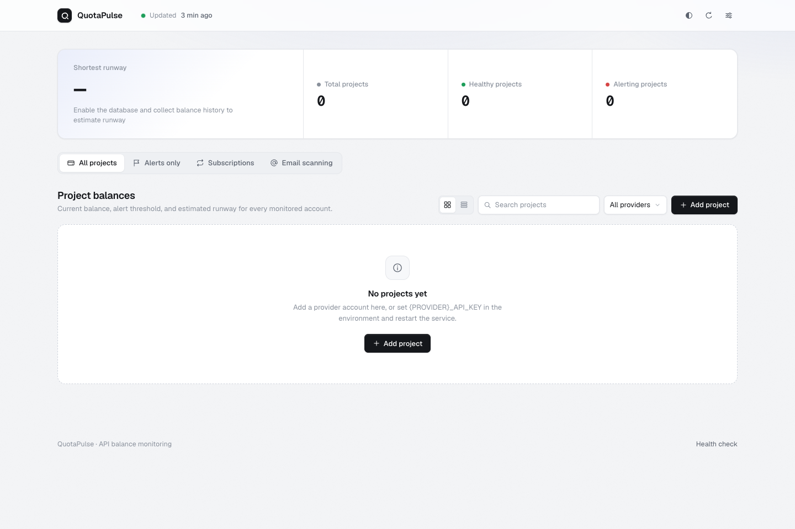
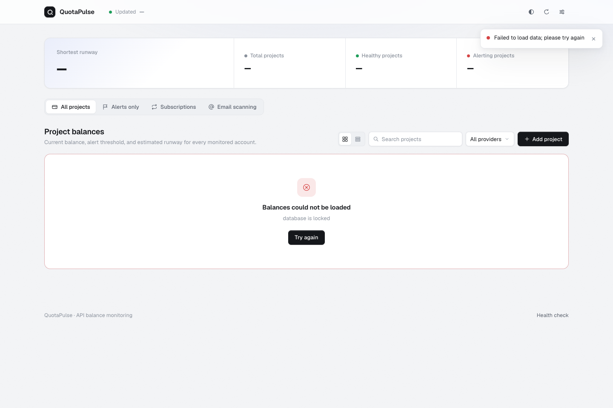
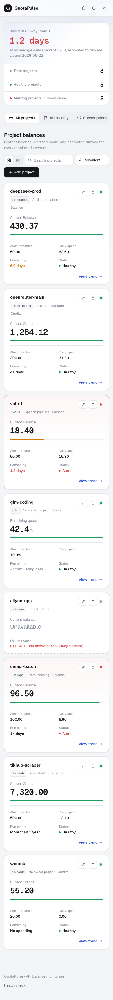

# Dashboard screenshots

A visual tour of the QuotaPulse dashboard. The interface ships in light and dark themes
(following the system preference until you toggle it), self-hosts the Geist font family,
and works down to phone widths. All data shown here is demo data served by a local mock.

## Overview and projects

The landing view. The overview band leads with the shortest runway across all accounts —
how many days until the tightest balance runs out — followed by total, healthy, and
alerting project counters. The last successful update time lives in the top navigation.

Alerting projects are tinted and outlined in red with a pulsing status dot; accounts whose
API became unreachable are shown as "Unavailable" with the failure reason inline, so a dead
key is obvious at a glance.

The grid/list toggle switches between cards and a compact single-surface table. Every
figure — balances, thresholds, daily spend, runway — is set in a monospace face with
tabular numerals, so columns of numbers stay aligned.

## Subscriptions

Renewal reminders sorted by next renewal date. The days-remaining figure turns amber
within 14 days and red within 7. Marking a subscription as renewed pushes its next date
back and flags the row until you clear the mark.

## Email scanning

IMAP mailboxes are scanned for billing and renewal emails. Summary chips show the scan
outcome, each mailbox reports its own connection status, and matched emails are listed
with the keywords that flagged them.

## Balance trend

With the history API enabled, "View trend" on a project card opens a 30-day balance chart
with the alert threshold as a dashed line and a hover tooltip. The chart reads its colors
and fonts from the theme, so it matches both modes.

## Destructive actions

Deleting a project, subscription, or mailbox opens an in-page confirmation with the focus
on Cancel, replacing the browser's native `confirm()` dialog.

## Empty and failure states

First run with no projects configured shows a getting-started panel; when the API cannot
be reached, the skeleton is replaced by an explanation with a retry button. Filtered views
that match nothing offer a one-click "Clear filters".

## Mobile

Below 768px the counters collapse into rows, the view switcher scrolls horizontally, and
card actions are always visible instead of hover-revealed.

